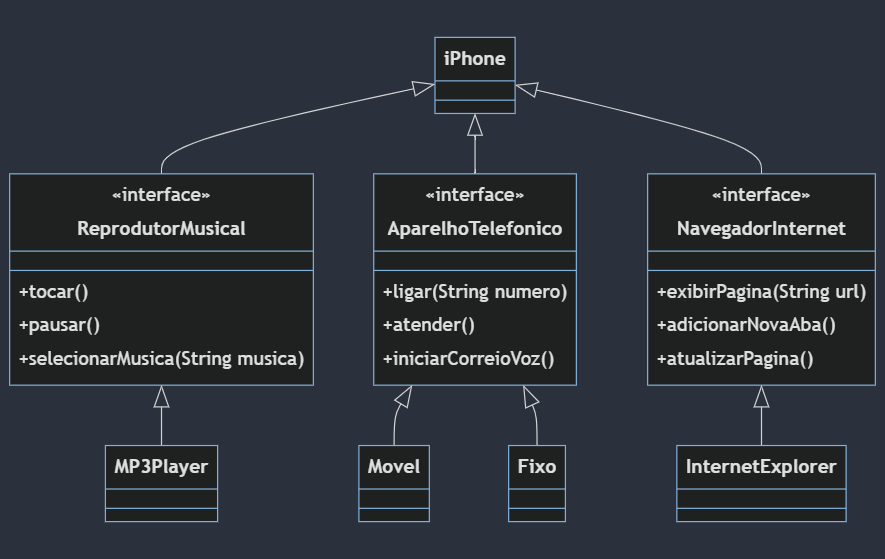

# POO - Desafio de Projeto 
## Modelam e Diagramação do Componente iPhone

## 💻Tecnologias Utilizadas
- __Java__: desenvolvimento do código 
- __Intellij__: IDE para o desenvolvimento do código fonte do projeto
- __Mermaid__: para a diagramação e modelagem do componente iPhone

## 📋Objeivo do Projeto

1. Criar um diagrama UML que representasse as funcionalidades do componente iPhone.
2. Implementar as classes e interfaces correspondentes em Java.

## ✅Funcionalidades implementadas

__Reprodutor Musical__
- Métodos: 
  - `tocar()`, 
  - `pausar()`, 
  - `selecionarMusica(String musica)`

__Aparelho Telefônico__
- Métodos: 
  - `ligar(String numero)`, 
  - `atender()`, 
  - `iniciarCorreioVoz()`

__Navegador na Internet__
- Métodos: 
  - `exibirPagina(String url)`, 
  - `adicionarNovaAba()`, 
  - `atualizarPagina()`

## 🎢Habilidades Aprimoradas
1. Desenvolimento de Classes
2. Implementação de Interfaces
3. Desenvolvimento de Diagramação com Mermaid